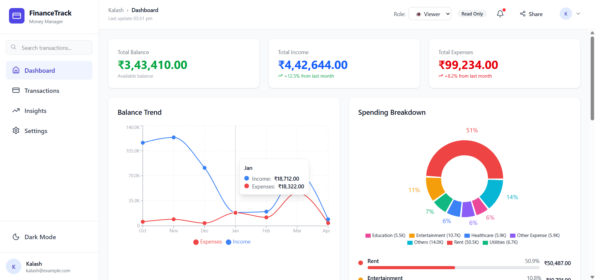
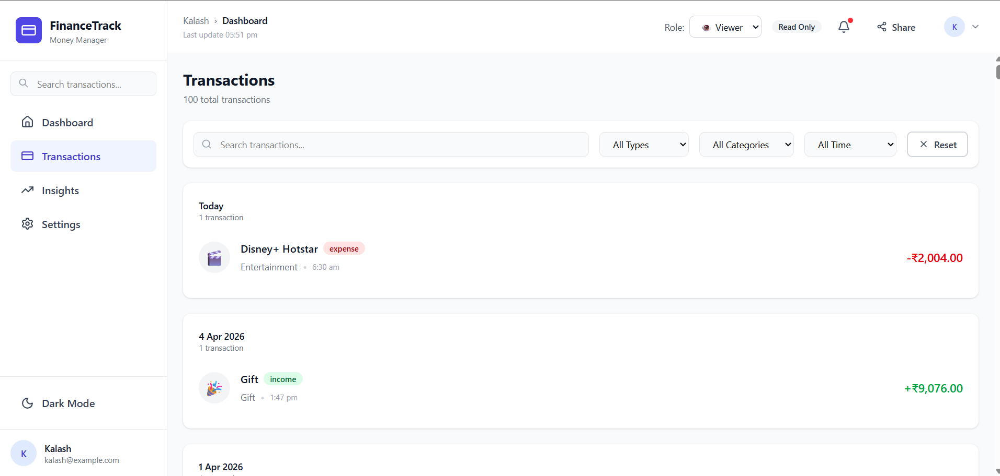
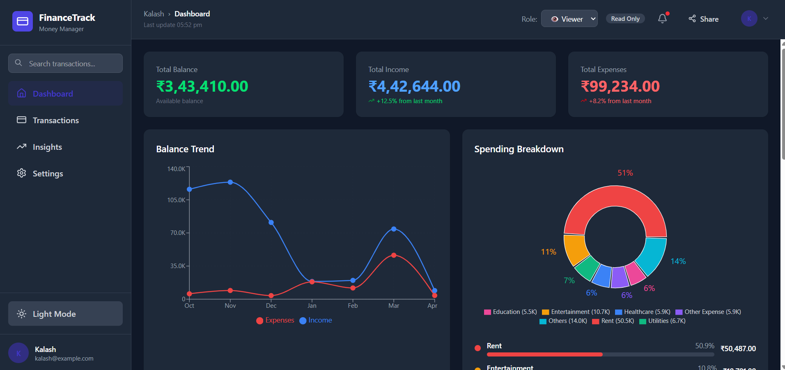
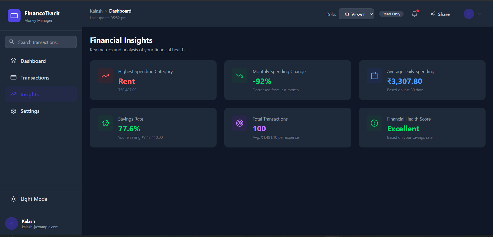

<h2>Live project link:- https://financial-dashboard-react-drab.vercel.app/ </h2>

# FinanceTrack — Personal Finance Dashboard

A modern personal finance dashboard built with React, Redux Toolkit, Tailwind CSS v4, and Recharts. Track income, expenses, and financial insights with a clean UI and dark mode support.

---

## Screenshots

### Dashboard (Light Mode)


### Transactions Page


### Dashboard (Dark Mode)


### Financial Insights (Dark Mode)


---

## Features

- **Dashboard** — Summary cards for balance, income, and expenses with trend charts
- **Balance Trend** — Line chart showing income vs. expenses over the last 6 months
- **Spending Breakdown** — Donut chart with category-wise expense breakdown
- **Income Breakdown** — Bar chart of income by category
- **Transactions** — Filterable, searchable transaction list grouped by date
- **Financial Insights** — Key metrics including savings rate, daily spending, and health score
- **Dark Mode** — Full dark mode toggle
- **Role-based Access** — Viewer (read-only) and Admin (add/edit/delete) roles
- **Add/Edit/Delete Transactions** — Modal form available in Admin role

---

## Tech Stack

| Tech | Purpose |
|------|---------|
| React 19 | UI framework |
| Redux Toolkit | State management |
| React Redux | Redux bindings |
| Tailwind CSS v4 | Styling |
| Recharts | Charts |
| Lucide React | Icons |
| Vite | Build tool |

---

## Getting Started

### Prerequisites
- Node.js 18+
- npm

### Installation

```bash
# Clone the repository
git clone <your-repo-url>
cd finance-dashboard

# Install dependencies
npm install

# Start the development server
npm run dev
```

The app will be available at `http://localhost:5173`.

### Build for Production

```bash
npm run build
```

---

## Project Structure

```
src/
├── components/
│   ├── common/          # Reusable UI components (Card, Button, Badge)
│   ├── dashboard/       # Dashboard charts (BalanceTrend, SpendingBreakdown, IncomeBreakdown)
│   ├── insights/        # InsightsPanel
│   ├── layout/          # Layout, Sidebar, Header
│   └── transactions/    # TransactionList, TransactionFilters, TransactionForm
├── data/
│   └── mockData.js      # Mock transaction generator
├── redux/
│   ├── store.js
│   └── slices/
│       ├── transactionsSlice.js
│       ├── uiSlice.js
│       └── authSlice.js
└── utils/
    ├── calculations.js
    ├── constants.js
    └── formatters.js
```

---

## Usage

- Switch between **Dashboard**, **Transactions**, **Insights**, and **Settings** from the sidebar
- Toggle **Dark Mode** using the sidebar button
- Switch to **Admin** role from the header dropdown to enable adding/editing/deleting transactions
- Use filters on the Transactions page to search by type, category, or date range
